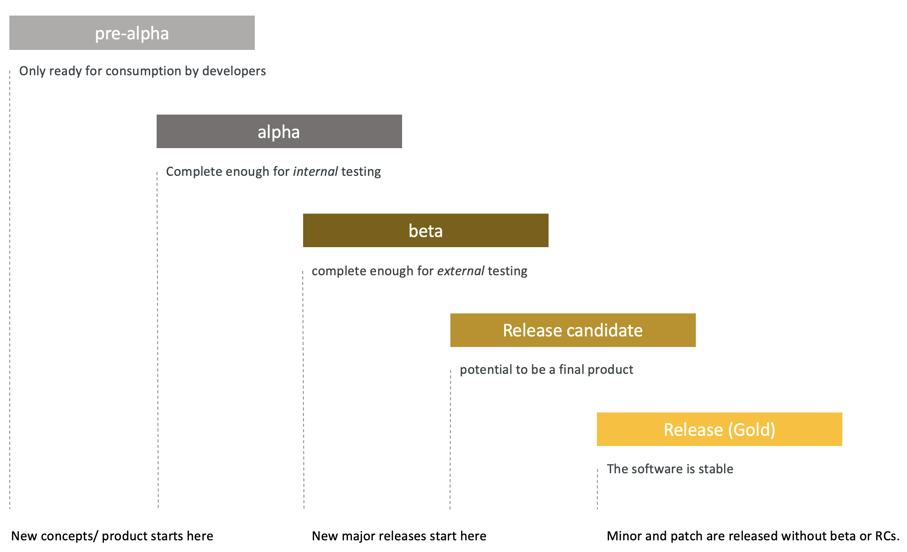

# Release Management

Spartacus is released bi-weekly. Currently there's a single release process, while we're building release 1.0.0. As soon as release 1.0.0 is released, there will be parallel release streams in order to build new features and maintain existing features. 

## Release types
We use the following release types:
- pre-alpha
- alpha
- beta
- Release Candidate (RC)
- Gold release

### Pre-alpha
Pre-alpha releases are only ready for consumption by internal developers.  Spartacus has started in pre0alpha to  a poc into first development cycles we decided to move it into pre-alpha, just to manage the expectations. 

### Alpha
Alpha versions of Spartacus aim to be complete enough for *internal* testing. Other non-spartacus teams can evaluate (and even use) alpha releases although they should be aware that breaking changes *will *appear without warning. 

### Beta
Beta versions of Spartacus are complete enough for *external* testing. There are no significant changes to be expected. Beta releases are the formalisation of getting external feedback. 

New major releases will start with a beta release, in parallel of minor and patches on the latest major release. 

### Release Candidate (RC)
Release candidates of Spartacus are potential final releases. Minor fixes can be added at this point in time. Whenever there are no fixes needed, the lates RC will become the first golden release. 

### Gold release 
The gold release represents the final stable release of the features of a major release. 

### Nightly builds
Nightly builds are not yet implemented, but on the wishlist (#438). Nightly builds would help developers to use features as soon as they're merged into the develop branch without any custom build effort. 

## Versioning
- Spartucus uses semantic versioning
- Spartucus is released bi-weekly
- Major releases are expected every 6 - 9 months
- Minor releases are expected every 2 months
- Patch releases are exptected every 2 weeks

